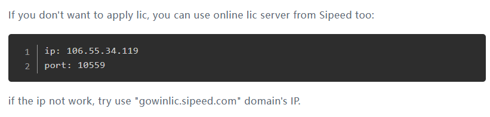
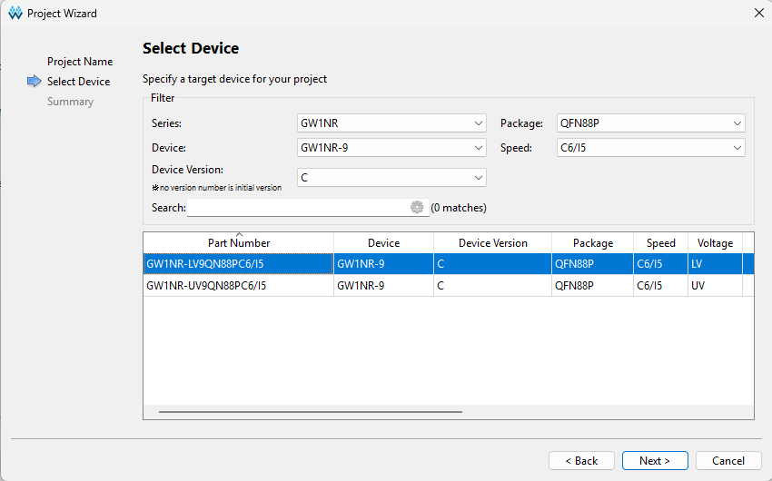
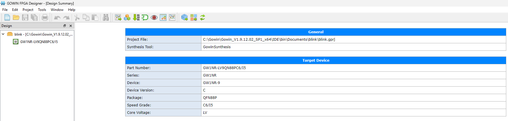
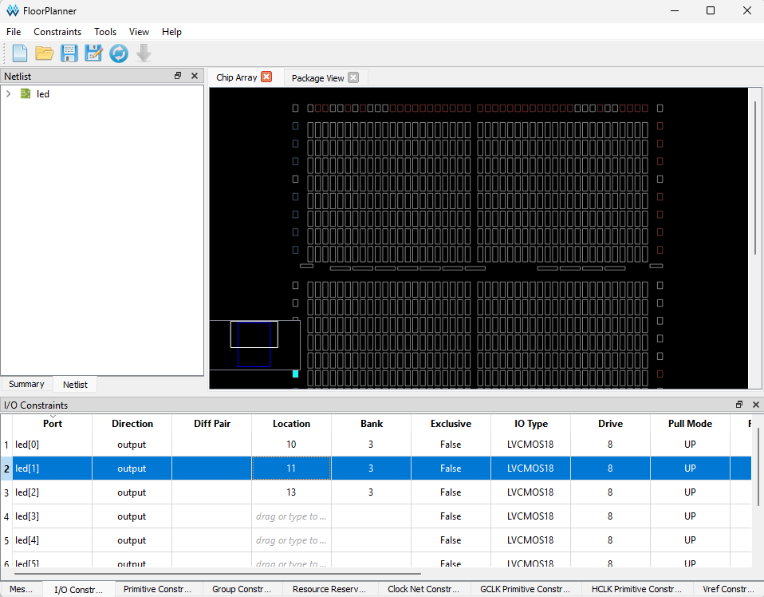
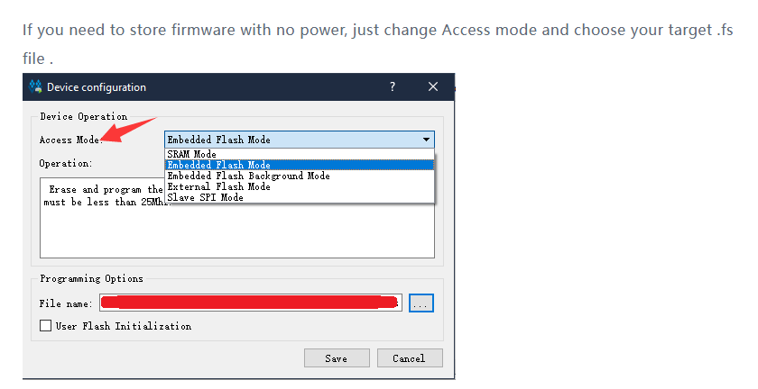
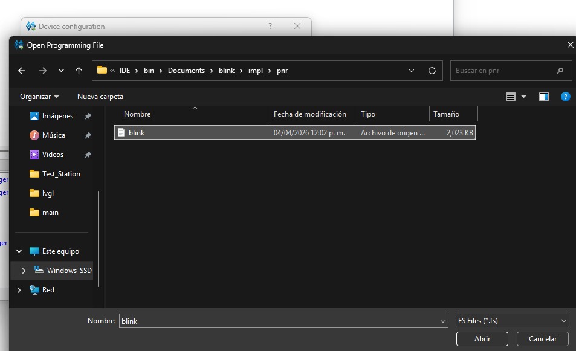

# ehh titulo xd

Primer microcontrolador de 8 bits basado en RISC-V diseñado en Guatemala.

---

## Herramientas necesarias

| Herramienta | Propósito | Plataforma |
|---|---|---|
| Python 3.8+ | Assembler, scripts de soporte | Windows / Linux / macOS |
| Icarus Verilog | Simulación RTL | Windows / Linux / macOS |
| GTKWave | Visualización de waveforms | Windows / Linux / macOS |
| Gowin EDA | Síntesis para Tang Nano 9K | Windows / Linux |
| pyserial | Carga de programas via UART | Python (pip) |

---

## Python

Verificar instalación:

```
python3 --version
```

Instalar dependencias del proyecto:

```
pip install pyserial
```

---

## Icarus Verilog

### Windows

Descargar el instalador desde:

```
https://bleyer.org/icarus/
```

Buscar el archivo `iverilog-v12-x86_64-setup.exe` (o la versión más reciente).
Ejecutar el instalador y marcar la opción "Add to PATH".

Verificar:

```
iverilog -V
vvp -V
```

### Linux (Ubuntu / Debian)

```
sudo apt update
sudo apt install iverilog
```

---

## GTKWave

GTKWave es el visualizador de waveforms muy util al momento de hacer debug. 
La instalación puede ser complicada en Windows.
Seguir exactamente estos pasos.

### Windows

1. Ir a la página de descargas en SourceForge:

```
https://sourceforge.net/projects/gtkwave/files/
```

2. Buscar la carpeta `gtkwave-3.3.x-bin-win64` (la versión más reciente disponible).

3. Descargar el archivo `.zip`, por ejemplo:

```
gtkwave64-3.3.117-bin-win64.zip
```

4. Extraer el contenido. Quedará una carpeta con esta estructura:

```
gtkwave64\
  bin\
    gtkwave.exe    <- este es el ejecutable
    libgtk-...dll
    ...
```

5. Agregar la carpeta `bin\` al PATH del sistema:
   - Abrir "Variables de entorno del sistema"
   - En "Path" agregar: `C:\gtkwave64\bin` (ajustar según donde se extrajo)

6. Verificar en una terminal nueva:

```
gtkwave --version
```

Si no se quiere modificar el PATH, editar la variable `GTKWAVE_PATH` en `sim_gui.py`:

```python
GTKWAVE_PATH = r"C:\gtkwave64\bin\gtkwave.exe"
```

### Linux

```
sudo apt install gtkwave
```

---

## Gowin EDA (para Tang Nano 9K)

Solo necesario si se va a sintetizar para FPGA.

1. Registrarse en el sitio de Gowin (registro gratuito):

```
https://www.gowinsemi.com/en/support/download_eda/
```

2. Descargar `Gowin EDA Education` (versión gratuita, soporta todos los FPGAs de Gowin).

3. Instalar y activar la licencia gratuita o utilizar la licencia predeterminada


4. En Gowin EDA, crear un proyecto nuevo:
   - Device: `GW1NR-9C`
   - Package: `QFN88`
   - Speed: `C6/I5`



Asi nos queda la configuracion del dispositivo


---

5. Una vez seleccionada la FPGA se deben interconectar las entradas y salidas en **FloorPlanner**


6. Luego de compilar y comprobar que no hayan errores de conexiones se debe elegir el archivo `.fs` y las demas configuraciones del programa


7. el archivo `.fs` es dificil de encontrar ya que no es explicito donde se genera el archivo luego de compilar, aca hay un ejemplo de donde se encuentra el archivo

Siempre siguen esta estructura 
`[Tu Carpeta del Proyecto] → impl → pnr → [nombre_de_tu_proyecto].fs`

8. Una vez que tengas localizado tu archivo `.fs`, regresa al Gowin Programmer y asegúrate de configurarlo correctamente según lo que quieras hacer. 
En la ventana de **Device configuration**, que es a la que accedes con doble click bajo **Operation**

9. Luego se debe elegir el modo de programacion:

Access Mode: Aquí eliges dónde quieres cargar el programa.

- SRAM Mode / SRAM Program: El programa se carga en la memoria volátil de la FPGA. Es ideal para pruebas rápidas, pero se borra cuando la FPGA se apaga .

- External Flash Mode / embFlash Erase, Program: El programa se guarda en la memoria flash. Esto es para que la FPGA ejecute tu código cada vez que se encienda .

- File name: Aquí es donde debes navegar y seleccionar el archivo .fs que generaste.

- Device: Asegúrate de que coincida con tu FPGA. Por tu captura, parece una GW1NR-9C

**Resumen rápido** 
Si no se encuentra el archivo `.fs` es por que aun no se ha sintetizado correctamente.
- Ve a **Gowin FPGA Designer**, carga tu proyecto y dale a **Synthesize**
- Luego a **Place & Route**
- El archivo aparecerá en la carpeta `impl/pnr/` de tu proyecto. 
- Luego, en el **Programmer**, solo debes ir a esa ruta y seleccionarlo.
