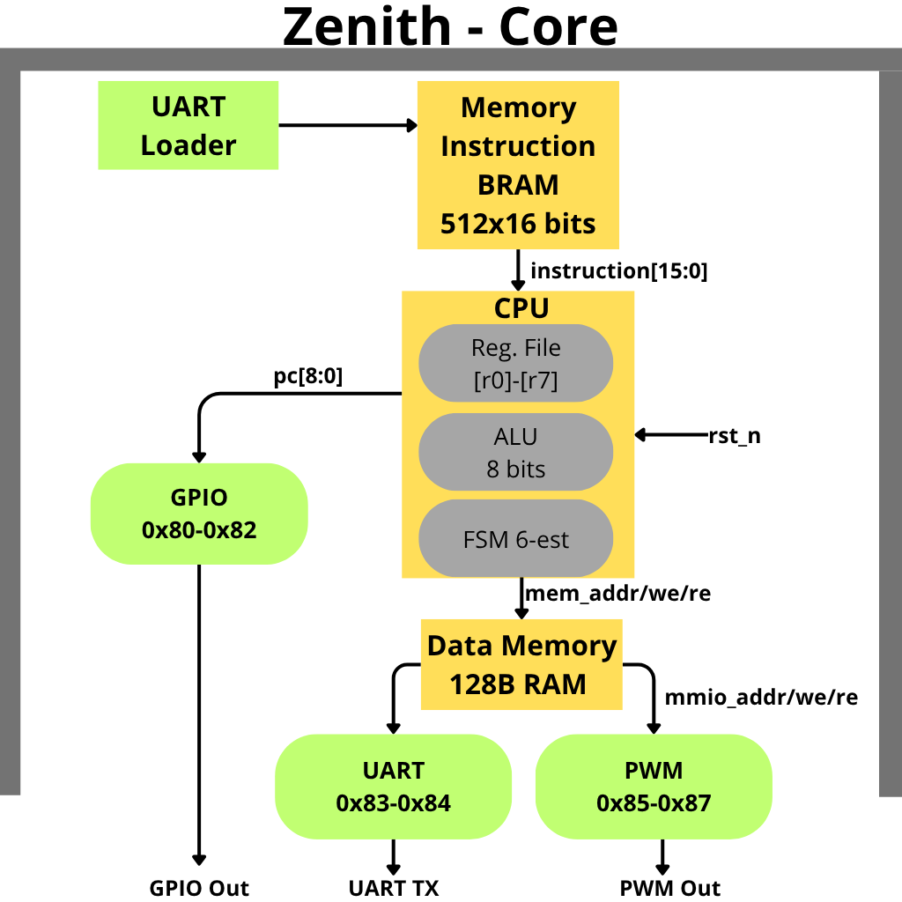

<div align="center">

# Zenith Core

**Primer microcontrolador de 8 bits basado en RISC-V diseñado en Guatemala.**  
ISA de 16 bits propia · 8 registros · periféricos MMIO · Tang Nano 9K


</div>

---

## Que es esto

Zenith Core es un microcontrolador de 8 bits diseñado completamente desde cero en Verilog y sintetizado en una FPGA Gowin. Incluye su propio ISA, ensamblador, cargador UART, periféricos MMIO y un IDE gráfico para escribir y flashear programas sin tocar la terminal.

Los programas se cargan por UART sin resintetizar. El CPU corre a 27 MHz con 4.5 MIPS efectivos.

---

## Hardware

<div align="center">


*Sipeed Tang Nano 9K — Gowin GW1NR-9C, 8640 LUTs, 27 MHz*

</div>

| Pin | Señal | Descripcion |
|-----|-------|-------------|
| 17 | UART RX | Recibe programas desde PC |
| 18 | UART TX | Transmite datos por UART |
| 25 | PWM OUT | Salida PWM |
| 10–15 | LED[0–5] | 6 LEDs activos en bajo (GPIO bits 0–5) |
| S1 | RESET | Reset activo en bajo |

---

## Arquitectura

<div align="center">



</div>

El sistema completo vive en `microrv8_system.v`. El CPU tiene una FSM de 6 estados diseñada para absorber la latencia de 1 ciclo de la BRAM sincrona de Gowin. El loader UART escribe directamente en la instruction memory en tiempo real sin resintetizar.

---

## En accion

<div align="center">


*Contador binario corriendo en la FPGA después se le carga un programa que enciende todos los LED*

</div>

---

## Inicio rápido

```bash
# IDE grafico: escribir, ensamblar y flashear
python3 JoJoP_IDE.py

# GUI de simulacion
python3 sim_gui.py
```

### Desde terminal

```bash
# Ensamblar
python3 tools/assembler.py programs/mi_prog.asm --binary -o programs/mi_prog.bin

# Cargar a la FPGA sin resintetizar
python3 tools/uart_flash.py programs/mi_prog.bin --port COM17
```

---

## ISA

8 registros (r0–r7). r0 siempre es 0. Instrucciones de 16 bits. 6 ciclos por instrucción.

```
ADDI rd, rs1, imm    rd = rs1 + imm       imm: -8 a +7
ADD  rd, rs1, rs2    rd = rs1 + rs2
SUB  rd, rs1, rs2    rd = rs1 - rs2
AND / OR / XOR / SLL / SRL / SLT
LOAD  rd, rs1, imm   rd = MEM[rs1 + imm]
STORE rs2, rs1, imm  MEM[rs1 + imm] = rs2
BEQ  rs1, rs2, lbl   salto si rs1 == rs2   offset: -8 a +7
JUMP label           salto absoluto         0 a 511
JAL  rd, label       rd = PC+1; salto
OUT  rs1             gpio_out = rs1
```

Mapa MMIO: `0x80` GPIO_OUT · `0x81` GPIO_IN · `0x82` GPIO_DIR · `0x83` UART_TX · `0x84` UART_STAT · `0x85–0x87` PWM.

Ver `TIPS_ASM.md` para delays calibrados, patrones y errores frecuentes.

---

## Recursos de síntesis

| Recurso | Uso | Total | Porcentaje |
|---------|-----|-------|------------|
| Logic (LUT + ALU) | 752 | 8640 | 9% |
| Register (FF) | 388 | 6693 | 6% |
| BSRAM | 2 | 26 | 8% |

91% de LUTs disponibles para expansion. 4.5 MIPS a 27 MHz.

---

## Estructura del repo

```
Zenith-Core/
  JoJoP_IDE.py          IDE grafico
  sim_gui.py            GUI de simulacion
  TIPS_ASM.md           Guia de assembly y delays

  rtl/
    cpu_core.v            CPU FSM 6 estados
    instruction_memory.v  BRAM 512x16 bits
    data_memory.v         RAM 128 bytes + decodificador MMIO
    uart_loader.v         Loader UART
    uart.v                UART TX/RX
    gpio.v / pwm.v        Perifericos
    microrv8_system.v     Sistema completo
    tang_nano_top.v       Top level para sintesis
    tang_nano_9k.cst      Constraints de pines

  tools/
    assembler.py          Ensamblador con listing
    uart_flash.py         Flasher UART

  programs/              Programas de ejemplo
  sim/                   Testbenches Verilog
  docs/                  Documentacion completa
  imgs/                  Imagenes y diagramas
```

---

## Dependencias

| Herramienta | Para que | Instalar |
|-------------|----------|---------|
| Python 3.8+ | assembler, IDEs, uart_flash | python.org |
| PyQt5 | JoJoP_IDE | `pip install PyQt5` |
| pyserial | cargar programas | `pip install pyserial` |
| Icarus Verilog | simulacion | `apt install iverilog` |
| GTKWave | ver waveforms | `apt install gtkwave` |
| cocotb | tests Python | `pip install cocotb` |
| Gowin EDA | sintesis FPGA | gowinsemi.com (gratuito) |

Ver `docs/Instalacion.md` para instrucciones detalladas.

---

## Documentacion

| Archivo | Contenido |
|---------|-----------|
| `TIPS_ASM.md` | Delays calibrados, patrones de assembly, errores comunes |
| `docs/documentacion.md` | Referencia completa: ISA, modulos RTL, herramientas |
| `docs/Instalacion.md` | Instalacion de todas las herramientas |
| `docs/FPGA.md` | Sintesis y programacion en Gowin EDA |
| `docs/ejercicios/guia_inicial.md` | Verilog y cocotb desde cero |
| `docs/ejercicios/LABS_COCOTB.md` | 11 laboratorios de simulacion |
| `docs/ejercicios/HT_FPGA.md` | Hoja de trabajo FPGA y assembly |

---

<div align="center">

Diseñado en Guatemala Por Pablo Lopez

</div>